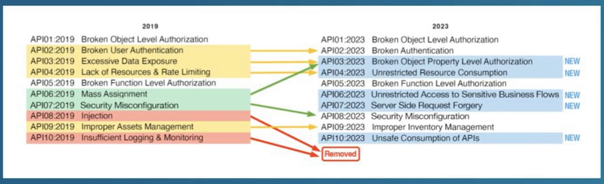

# Continuous Learning in DevSecOps

A collection of organized study logs covering a range of DevSecOps topics.

## Bug Bounty Research

- [PentesterLand Writeups Compilation](https://pentester.land/writeups/)
- [HackerOne Hacktivity](https://hackerone.com/hacktivity)
- [Awesome Bug Bounty Writeups Repo](https://github.com/devanshbatham/Awesome-Bugbounty-Writeups)

## OWASP API Security Top 10

## 2019 vs 2023 comparison chart

### API Incidents

Recent API security incidents:

- [2023 EatonWorks Toyota Research Disclosure](https://eaton-works.com/2023/02/06/toyota-gspims-hack/)
- [2023 T-Mobile API Data Exposure](https://venturebeat.com/security/t-mobile-data-breach-shows-api-security-cant-be-ignored/)
